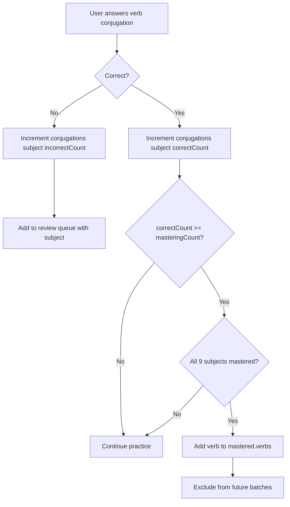
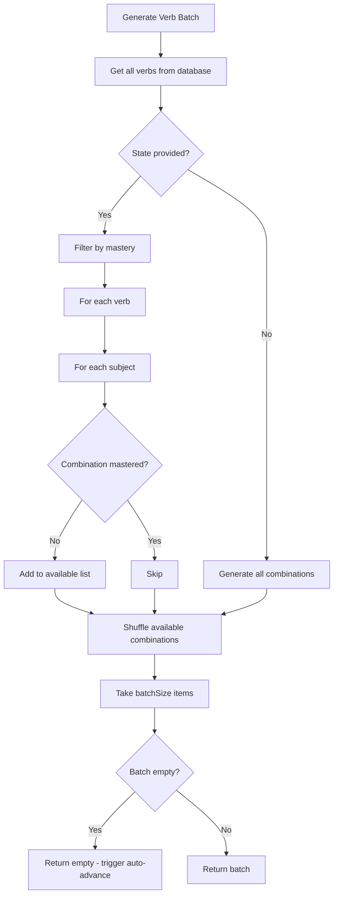
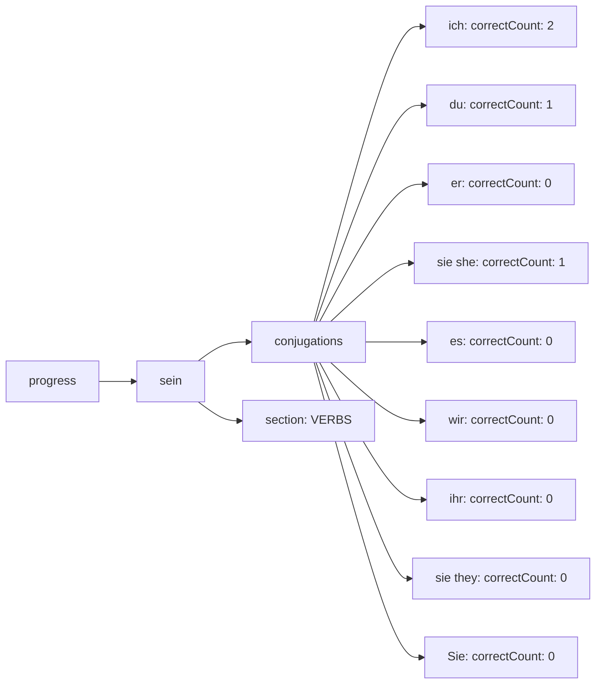

# Verb Mastery Tracking Implementation Plan

## Overview
Implement comprehensive mastery tracking for verb conjugations where a verb is considered mastered only when **all 9 subject+verb combinations** have been answered correctly >= `masteringCount` times.

## Current State Analysis

### Existing Verb Tracking
**Location:** [`src/utils/vocabularyManager.js:421-479`](src/utils/vocabularyManager.js:421)

**Current Behavior:**
- Generates random verb+subject combinations
- Does NOT filter by mastery status
- Does NOT accept `state` parameter
- Always returns batches from all available verbs
- Never auto-advances when exhausted

**Subject List (9 total):**
```javascript
const subjects = [
  'ich',           // I
  'du',            // you (informal)
  'er',            // he
  'sie (she)',     // she
  'es',            // it
  'wir',           // we
  'ihr',           // you (plural informal)
  'sie (they)',    // they
  'Sie'            // you (formal)
]
```

### Current Progress Structure
**Location:** [`src/hooks/useVocabularyState.js:262-429`](src/hooks/useVocabularyState.js:262)

**Current Format:**
```javascript
progress: {
  "sein": {
    singular: { correctCount: 0, incorrectCount: 0 },
    plural: { correctCount: 0, incorrectCount: 0 },
    section: "VERBS"
  }
}
```

**Problem:** This structure tracks the verb as a whole, not individual subject combinations.

---

## Design: Verb+Subject Combination Tracking

### 1. Progress Data Structure

#### Option A: Nested Subject Structure (RECOMMENDED)
```javascript
progress: {
  "sein": {
    conjugations: {
      "ich": { correctCount: 0, incorrectCount: 0 },
      "du": { correctCount: 0, incorrectCount: 0 },
      "er": { correctCount: 0, incorrectCount: 0 },
      "sie (she)": { correctCount: 0, incorrectCount: 0 },
      "es": { correctCount: 0, incorrectCount: 0 },
      "wir": { correctCount: 0, incorrectCount: 0 },
      "ihr": { correctCount: 0, incorrectCount: 0 },
      "sie (they)": { correctCount: 0, incorrectCount: 0 },
      "Sie": { correctCount: 0, incorrectCount: 0 }
    },
    section: "VERBS"
  }
}
```

**Advantages:**
- Clear hierarchical structure
- Easy to query all subjects for a verb
- Consistent with existing dual-form noun tracking
- Easy to calculate verb mastery (check all 9 subjects)

**Disadvantages:**
- Requires migration of existing verb progress data
- More complex validation logic

#### Option B: Composite Key Structure
```javascript
progress: {
  "sein|ich": { correctCount: 0, incorrectCount: 0, section: "VERBS" },
  "sein|du": { correctCount: 0, incorrectCount: 0, section: "VERBS" },
  "sein|er": { correctCount: 0, incorrectCount: 0, section: "VERBS" },
  // ... etc
}
```

**Advantages:**
- Simpler to implement (minimal changes to existing code)
- Works with existing `updateProgress()` function
- Easy to track individual combinations

**Disadvantages:**
- Harder to query all subjects for a verb
- Less intuitive structure
- Requires parsing keys to extract verb/subject

### **RECOMMENDATION: Use Option A (Nested Subject Structure)**
Provides better organization and aligns with the existing dual-form noun tracking pattern.

---

## Implementation Plan

### Phase 1: Update Progress Data Structure

#### 1.1 Modify `useVocabularyState.js`

**File:** [`src/hooks/useVocabularyState.js`](src/hooks/useVocabularyState.js)

**Changes Required:**

##### A. Update `getInitialState()` (Line 44)
No changes needed - progress starts empty.

##### B. Create Verb Progress Validation Function
```javascript
/**
 * Validate and initialize verb conjugation progress structure
 * @param {string} verb - Verb infinitive (e.g., "sein")
 * @param {Object} existingData - Existing progress data for this verb
 * @returns {Object} Validated verb progress structure
 */
const validateVerbProgress = (verb, existingData = {}) => {
  const subjects = [
    'ich', 'du', 'er', 'sie (she)', 'es', 
    'wir', 'ihr', 'sie (they)', 'Sie'
  ]
  
  // Check if old format (singular/plural)
  if (existingData.singular || existingData.plural) {
    console.warn(`Converting old verb format for "${verb}" to conjugation tracking`)
    existingData = {} // Reset to new format
  }
  
  const conjugations = {}
  subjects.forEach(subject => {
    conjugations[subject] = existingData.conjugations?.[subject] || {
      correctCount: 0,
      incorrectCount: 0
    }
  })
  
  return {
    conjugations,
    section: existingData.section || 'VERBS'
  }
}
```

##### C. Update `validateProgressStructure()` (Line 7)
```javascript
const validateProgressStructure = (progressData) => {
  const validatedProgress = {}
  
  for (const [word, data] of Object.entries(progressData)) {
    // Detect word type based on section or structure
    const section = data.section || 'Unknown'
    
    if (section === 'VERBS') {
      // Validate verb conjugation structure
      validatedProgress[word] = validateVerbProgress(word, data)
    } else if (data.singular && data.plural) {
      // Existing dual-form noun validation
      validatedProgress[word] = {
        singular: {
          correctCount: data.singular.correctCount || 0,
          incorrectCount: data.singular.incorrectCount || 0
        },
        plural: {
          correctCount: data.plural.correctCount || 0,
          incorrectCount: data.plural.incorrectCount || 0
        },
        section: section
      }
    } else if (data.conjugations) {
      // Already in new verb format
      validatedProgress[word] = validateVerbProgress(word, data)
    } else {
      // Default to empty dual-form structure for other words
      console.warn(`Invalid progress data for word "${word}", initializing fresh`)
      validatedProgress[word] = {
        singular: { correctCount: 0, incorrectCount: 0 },
        plural: { correctCount: 0, incorrectCount: 0 },
        section: section
      }
    }
  }
  
  return validatedProgress
}
```

##### D. Update `updateProgress()` Function (Line 262)
```javascript
const updateProgress = (word, isCorrect, section = 'Unknown', form = 'singular', subject = null) => {
  // CRITICAL: Ensure word is defined
  if (!word) {
    console.error(`updateProgress called with invalid word: ${word} (Section: ${section})`)
    return state
  }

  const newState = { ...state }
  
  // Initialize progress structure based on section
  if (!newState.progress[word]) {
    if (section === 'VERBS') {
      newState.progress[word] = validateVerbProgress(word)
    } else {
      newState.progress[word] = {
        singular: { correctCount: 0, incorrectCount: 0 },
        plural: { correctCount: 0, incorrectCount: 0 },
        section: section
      }
    }
  }

  let wasAddedToReview = false
  let wasMovedToMastered = false

  // Handle verb conjugation tracking
  if (section === 'VERBS' && subject) {
    if (!newState.progress[word].conjugations) {
      newState.progress[word] = validateVerbProgress(word, newState.progress[word])
    }
    
    if (isCorrect) {
      newState.progress[word].conjugations[subject].correctCount++
      
      // Check if this specific combination should be removed from review
      const isInReviewQueue = newState.pools.reviewQueue.findIndex(item => 
        typeof item === 'string' ? item === word : (item.word === word && item.subject === subject)
      ) > -1
      
      const masteringThreshold = isInReviewQueue 
        ? newState.settings.maxReviewCount 
        : newState.settings.masteringCount
      
      // Remove from review queue if this combination is mastered
      if (isInReviewQueue && 
          newState.progress[word].conjugations[subject].correctCount >= masteringThreshold) {
        const reviewIndex = newState.pools.reviewQueue.findIndex(item => 
          typeof item === 'string' ? item === word : (item.word === word && item.subject === subject)
        )
        if (reviewIndex > -1) {
          newState.pools.reviewQueue.splice(reviewIndex, 1)
          console.log(`Removed "${word} (${subject})" from review queue`)
        }
      }
      
      // Check if ALL conjugations are mastered
      const allSubjects = [
        'ich', 'du', 'er', 'sie (she)', 'es', 
        'wir', 'ihr', 'sie (they)', 'Sie'
      ]
      const allMastered = allSubjects.every(subj => 
        newState.progress[word].conjugations[subj].correctCount >= newState.settings.masteringCount
      )
      
      if (allMastered) {
        // Remove from unselected
        const unselectedIndex = newState.pools.unselected.indexOf(word)
        if (unselectedIndex > -1) {
          newState.pools.unselected.splice(unselectedIndex, 1)
        }
        
        // Add to mastered verbs
        if (!newState.pools.mastered.verbs.includes(word)) {
          newState.pools.mastered.verbs.push(word)
          wasMovedToMastered = true
          console.log(`Verb "${word}" fully mastered - all 9 conjugations complete`)
        }
      }
    } else {
      newState.progress[word].conjugations[subject].incorrectCount++
      
      // Add to review queue with subject info
      const existsInReview = newState.pools.reviewQueue.findIndex(item => 
        typeof item === 'string' ? item === word : (item.word === word && item.subject === subject)
      )
      if (existsInReview === -1) {
        newState.pools.reviewQueue.push({ word, section, subject })
        wasAddedToReview = true
      }
      
      newState.currentSessionStats.mistakesMadeToday++
      newState.sessionStats.mistakesMade++
    }
  } else {
    // Existing logic for nouns and other word types
    // ... (keep existing code for singular/plural tracking)
  }

  // Update session stats
  if (wasAddedToReview) {
    newState.currentSessionStats.itemsAddedToReviewToday++
    newState.sessionStats.itemsAddedToReview++
  }

  saveState(newState)
  return newState
}
```

---

### Phase 2: Update VocabularyManager

#### 2.1 Add Verb Mastery Helper Methods

**File:** [`src/utils/vocabularyManager.js`](src/utils/vocabularyManager.js)

**Add after line 35:**

```javascript
/**
 * Check if a specific verb+subject combination is mastered
 * @param {string} verb - Verb infinitive
 * @param {string} subject - Subject pronoun
 * @param {Object} state - Application state
 * @returns {boolean} True if combination is mastered
 */
isVerbConjugationMastered(verb, subject, state) {
  const progress = state.progress[verb]
  if (!progress || !progress.conjugations || !progress.conjugations[subject]) {
    return false
  }
  return progress.conjugations[subject].correctCount >= state.settings.masteringCount
}

/**
 * Check if all conjugations of a verb are mastered
 * @param {string} verb - Verb infinitive
 * @param {Object} state - Application state
 * @returns {boolean} True if all 9 conjugations are mastered
 */
isVerbFullyMastered(verb, state) {
  const subjects = [
    'ich', 'du', 'er', 'sie (she)', 'es', 
    'wir', 'ihr', 'sie (they)', 'Sie'
  ]
  
  return subjects.every(subject => 
    this.isVerbConjugationMastered(verb, subject, state)
  )
}

/**
 * Get available (unmastered) verb+subject combinations
 * @param {Array} verbs - List of verb objects
 * @param {Object} state - Application state
 * @returns {Array} Array of {verb, subject, conjugation} objects
 */
getAvailableVerbCombinations(verbs, state) {
  const subjects = [
    'ich', 'du', 'er', 'sie (she)', 'es', 
    'wir', 'ihr', 'sie (they)', 'Sie'
  ]
  
  const combinations = []
  
  verbs.forEach(verb => {
    subjects.forEach(subject => {
      if (!this.isVerbConjugationMastered(verb.german, subject, state)) {
        combinations.push({
          verb: verb.german,
          verbEnglish: verb.english,
          subject: subject,
          conjugation: verb.conjugations[subject]
        })
      }
    })
  })
  
  return combinations
}
```

#### 2.2 Update `generateVerbBatch()` Method

**File:** [`src/utils/vocabularyManager.js:421-479`](src/utils/vocabularyManager.js:421)

**Replace with:**

```javascript
// Generate Step 6: Verb Conjugation (configurable items)
generateVerbBatch(exclude = [], batchSize = 10, state = null) {
  console.log('Generating verb batch with TRUE RANDOMIZATION:', { 
    exclude: exclude.slice(0, 5), 
    batchSize,
    hasState: !!state
  })
  
  // Get all verbs from all letters
  const allVerbs = getAllVerbsFromAllLetters([...exclude, ...this.excludeList])
  
  if (!allVerbs || allVerbs.length === 0) {
    console.error('No verbs available for conjugation batch')
    return []
  }

  // If state is provided, filter by mastery
  let availableCombinations
  if (state) {
    availableCombinations = this.getAvailableVerbCombinations(allVerbs, state)
    console.log('After filtering mastered verb combinations:', {
      totalVerbs: allVerbs.length,
      totalCombinations: allVerbs.length * 9,
      availableCombinations: availableCombinations.length,
      batchSize
    })
    
    // Return empty if all combinations are mastered
    if (availableCombinations.length === 0) {
      console.log('All verb conjugations have been mastered!')
      return []
    }
  } else {
    // No state - generate all combinations
    const subjects = [
      'ich', 'du', 'er', 'sie (she)', 'es', 
      'wir', 'ihr', 'sie (they)', 'Sie'
    ]
    
    availableCombinations = []
    allVerbs.forEach(verb => {
      subjects.forEach(subject => {
        availableCombinations.push({
          verb: verb.german,
          verbEnglish: verb.english,
          subject: subject,
          conjugation: verb.conjugations[subject]
        })
      })
    })
  }

  // Shuffle combinations for randomness
  const shuffled = [...availableCombinations].sort(() => 0.5 - Math.random())
  
  // Take requested batch size
  const selectedCombinations = shuffled.slice(0, batchSize)
  
  // Create subject mapping for display
  const subjectMapping = {
    'ich': { clean: 'ich', display: 'ich' },
    'du': { clean: 'du', display: 'du' },
    'er': { clean: 'er', display: 'er' },
    'sie (she)': { clean: 'sie', display: 'sie (she)' },
    'es': { clean: 'es', display: 'es' },
    'wir': { clean: 'wir', display: 'wir' },
    'ihr': { clean: 'ihr', display: 'ihr' },
    'sie (they)': { clean: 'sie', display: 'sie (they)' },
    'Sie': { clean: 'Sie', display: 'Sie' }
  }
  
  // Format batch items
  this.currentBatch = selectedCombinations.map(combo => {
    const subjectObj = subjectMapping[combo.subject]
    return {
      type: 'conjugation',
      question: `Conjugate "${combo.verbEnglish}" for "${subjectObj.display}" (e.g., "ich bin"):`,
      answer: `${subjectObj.clean} ${combo.conjugation}`,
      verb: combo.verb,
      verbEnglish: combo.verbEnglish,
      subject: subjectObj.display,
      cleanSubject: subjectObj.clean,
      conjugation: combo.conjugation,
      word: combo.verb // For progress tracking
    }
  })

  this.currentBatchIndex = 0
  
  // Track unique verbs used
  const uniqueVerbs = [...new Set(selectedCombinations.map(c => c.verb))]
  this.addToExcludeList(uniqueVerbs)
  
  console.log('Generated verb batch with TRUE RANDOMIZATION:', {
    totalAvailable: availableCombinations.length,
    batchSize: this.currentBatch.length,
    uniqueVerbs: uniqueVerbs.length
  })
  
  return this.currentBatch
}
```

---

### Phase 3: Update Daily Routine Hook

#### 3.1 Update Verb Step Generation

**File:** [`src/hooks/useDailyRoutine.js:493-517`](src/hooks/useDailyRoutine.js:493)

**Replace with:**

```javascript
case 'VERBS':
  // Pass state to enable mastery filtering
  batch = vocabManager.generateVerbBatch([], state.settings.maxVerbsQuestions, state)
  
  // Check if all verb conjugations are mastered
  if (batch.length === 0) {
    addSystemMessage(`🎉 **All verb conjugations have been mastered!**

All verb+subject combinations have been answered correctly ${state.settings.masteringCount} times and are now in your mastered pool.

Moving to **Step 7: Daily Recap** in 1 second...`)
    
    // Automatically move to next step after standardized delay
    setTimeout(() => {
      skipToNextStepFromStep(6)
    }, 2000)
    return
  }
  
  setCurrentBatch(batch)
  setBatchProgress({ completed: 0, total: batch.length })
  setIsBatchMode(true)
  
  // Track session learning for verbs
  const uniqueVerbs = [...new Set(batch.map(item => item.word))]
  trackSessionLearning('verbs', uniqueVerbs.length)
  
  // CRITICAL FIX: Reset answers when starting a new batch
  setBatchAnswers({})
  
  let verbsMessage = `### **Step 6: Verb Conjugation (${config.totalItems} Items)**
**[Step 6 | Batch 1 | Remaining: ${batch.length}]**

Please conjugate the following **verbs for the given subjects**:

`
  // Number the items sequentially starting from 1 with translation and speech markers
  batch.forEach((item, index) => {
    verbsMessage += `{{translate:${item.verbEnglish}}} *${index + 1}.* {{speak:${item.verb}}} (${item.subject})\n`
  })
  addSystemMessage(verbsMessage)
  
  return
```

#### 3.2 Update Progress Tracking Calls

**File:** [`src/hooks/useDailyRoutine.js:806-808`](src/hooks/useDailyRoutine.js:806)

**Update to pass subject for verb conjugations:**

```javascript
// Ensure word is defined for progress tracking
const wordToTrack = exercise.word || exercise.german || exercise.english || exercise.question

if (!wordToTrack) {
  console.warn('Missing word for progress tracking:', exercise)
}

if (isCorrect) {
  feedback += `${index + 1}. **${prompt}**: Your answer: **${userAnswer}** ✅\n`
  // Update progress for correct answers with form and subject information
  if (wordToTrack) {
    const subject = exercise.type === 'conjugation' ? exercise.cleanSubject : null
    updateProgress(wordToTrack, true, `${stepName}`, exercise.form || 'singular', subject)
  }
} else {
  const helpQuery = encodeURIComponent(`Why is "${userAnswer}" wrong for "${prompt}" in German?`)
  const correctDisplay = Array.isArray(exercise.answer) 
    ? exercise.answer.join(' or ') 
    : exercise.answer
  feedback += `${index + 1}. **${prompt}**: Your answer: **${userAnswer}** <span style="color: red;">**Correction:**</span> **${correctDisplay}** <a href="https://chatgpt.com/?q=${helpQuery}" target="_blank" rel="noopener noreferrer" title="Ask ChatGPT for explanation">💡</a>\n`
  
  // Update progress for incorrect answers with form and subject information
  if (wordToTrack) {
    const subject = exercise.type === 'conjugation' ? exercise.cleanSubject : null
    updateProgress(wordToTrack, false, `${stepName}`, exercise.form || 'singular', subject)
  }
}
```

---

### Phase 4: Update Review Queue Handling

#### 4.1 Update Review Batch Generation

**File:** [`src/utils/vocabularyManager.js:58-239`](src/utils/vocabularyManager.js:58)

**Update VERBS case (around line 111):**

```javascript
case 'VERBS':
  if (letterData.type === 'verb') {
    // Extract subject from review item if available
    const reviewSubject = typeof item === 'object' && item.subject 
      ? item.subject 
      : null
    
    // Use stored subject or pick random one
    const subjectMapping = {
      'ich': { clean: 'ich', display: 'ich' },
      'du': { clean: 'du', display: 'du' },
      'er': { clean: 'er', display: 'er' },
      'sie (she)': { clean: 'sie', display: 'sie (she)' },
      'es': { clean: 'es', display: 'es' },
      'wir': { clean: 'wir', display: 'wir' },
      'ihr': { clean: 'ihr', display: 'ihr' },
      'sie (they)': { clean: 'sie', display: 'sie (they)' },
      'Sie': { clean: 'Sie', display: 'Sie' }
    }
    
    const cleanSubjects = Object.keys(subjectMapping)
    const selectedSubject = reviewSubject || cleanSubjects[Math.floor(Math.random() * cleanSubjects.length)]
    const subjectObj = subjectMapping[selectedSubject]
    const conjugation = letterData.conjugations[selectedSubject]
    
    return {
      type: 'conjugation',
      question: `Conjugate "${letterData.english}" for "${subjectObj.display}" (e.g., "ich bin"):`,
      answer: `${subjectObj.clean} ${conjugation}`,
      verb: letterData.german,
      verbEnglish: letterData.english,
      subject: subjectObj.display,
      cleanSubject: subjectObj.clean,
      conjugation: conjugation,
      word: letterData.german,
      originSection: section
    }
  }
  break
```

---

## Testing Strategy

### Test Cases

#### 1. Basic Verb Conjugation Tracking
```javascript
// Test: Single verb, single subject
// Given: User answers "ich bin" correctly for "sein + ich"
// Expected: progress["sein"].conjugations["ich"].correctCount = 1
```

#### 2. Partial Verb Mastery
```javascript
// Test: Some subjects mastered, others not
// Given: User has mastered 5/9 subjects for "haben"
// Expected: 
//   - "haben" NOT in mastered.verbs
//   - Only 4 unmastered combinations appear in batch
```

#### 3. Full Verb Mastery
```javascript
// Test: All 9 subjects mastered
// Given: User answers all 9 conjugations correctly >= masteringCount
// Expected:
//   - "haben" added to mastered.verbs
//   - "haben" excluded from future batches
```

#### 4. Auto-Progression
```javascript
// Test: All verbs exhausted
// Given: All verbs in database have all 9 conjugations mastered
// Expected:
//   - generateVerbBatch() returns []
//   - System displays mastery message
//   - Auto-advances to Step 7 after 2 seconds
```

#### 5. Review Queue with Subjects
```javascript
// Test: Failed conjugation goes to review
// Given: User answers "du bist" incorrectly for "sein + du"
// Expected:
//   - reviewQueue contains { word: "sein", section: "VERBS", subject: "du" }
//   - Review presents same subject combination
```

#### 6. Import/Export Compatibility
```javascript
// Test: Export and re-import verb progress
// Given: User has partial progress on multiple verbs
// Expected:
//   - Export contains conjugations structure
//   - Import restores all conjugation counts
//   - Old format data is migrated to new structure
```

---

## Migration Strategy

### Handling Existing Data

#### Option 1: Automatic Migration (RECOMMENDED)
When loading old progress data with verb entries in singular/plural format:
1. Detect old format in `validateProgressStructure()`
2. Log warning to console
3. Initialize fresh conjugations structure (all zeros)
4. Preserve section information

#### Option 2: Manual Reset
Require users to clear verb progress:
1. Add migration notice in app
2. Provide "Reset Verb Progress" button
3. Keep noun progress intact

**RECOMMENDATION:** Use Option 1 for better UX. Users lose verb progress but it's minimal impact since verbs are practiced frequently.

---

## File Changes Summary

### Files to Modify

1. **[`src/hooks/useVocabularyState.js`](src/hooks/useVocabularyState.js)**
   - Add `validateVerbProgress()` function
   - Update `validateProgressStructure()` to handle verbs
   - Update `updateProgress()` to track verb+subject combinations
   - Update `importState()` to validate verb structures

2. **[`src/utils/vocabularyManager.js`](src/utils/vocabularyManager.js)**
   - Add `isVerbConjugationMastered()` helper
   - Add `isVerbFullyMastered()` helper
   - Add `getAvailableVerbCombinations()` helper
   - Update `generateVerbBatch()` to filter by mastery
   - Update `generateReviewBatch()` VERBS case to use stored subject

3. **[`src/hooks/useDailyRoutine.js`](src/hooks/useDailyRoutine.js)**
   - Update VERBS case in `skipToNextStepFromStep()` to check for empty batch
   - Add auto-progression message when all verbs mastered
   - Update `generateBatchFeedback()` to pass subject to `updateProgress()`

4. **[`plan/Requirements.md`](plan/Requirements.md)** (Documentation)
   - Add section documenting verb+subject mastery tracking
   - Update JSON state structure example

---

## Implementation Sequence

### Step 1: Data Structure (1-2 hours)
- [ ] Add `validateVerbProgress()` to useVocabularyState
- [ ] Update `validateProgressStructure()` for verb handling
- [ ] Test with sample data

### Step 2: Progress Tracking (2-3 hours)
- [ ] Update `updateProgress()` to accept subject parameter
- [ ] Add verb conjugation tracking logic
- [ ] Add mastery checking for all 9 subjects
- [ ] Test progress updates

### Step 3: Batch Generation (2-3 hours)
- [ ] Add helper methods to VocabularyManager
- [ ] Update `generateVerbBatch()` with mastery filtering
- [ ] Test batch generation with various mastery states

### Step 4: Auto-Progression (1 hour)
- [ ] Update VERBS case in useDailyRoutine
- [ ] Add empty batch check and message
- [ ] Test auto-advancement

### Step 5: Review Queue (1-2 hours)
- [ ] Update review batch generation for verbs
- [ ] Test review queue with subject tracking

### Step 6: Testing & Validation (2-3 hours)
- [ ] Run all test cases
- [ ] Test import/export with new structure
- [ ] Test migration from old format
- [ ] Verify auto-progression works

### Step 7: Documentation (1 hour)
- [ ] Update Requirements.md
- [ ] Add inline code comments
- [ ] Update any user-facing help text

**Total Estimated Time:** 10-15 hours

---

## Rollback Plan

If issues arise during implementation:

1. **Preserve Old Code:** Keep backup of original files
2. **Feature Flag:** Add setting to disable verb mastery tracking
3. **Data Validation:** Ensure old format data still loads
4. **Gradual Rollout:** Test with small user group first

---

## Success Criteria

✅ **Implementation Complete When:**
1. Verb progress tracks all 9 subject combinations separately
2. Batch generation filters out mastered combinations
3. Verb is added to mastered pool only when all 9 subjects mastered
4. Step 6 auto-advances when all verbs exhausted
5. Review queue preserves subject information for verbs
6. Import/export handles new structure correctly
7. Old format data migrates without errors
8. All test cases pass

---

## Mermaid Diagrams

### Verb Mastery Flow



### Batch Generation with Mastery Filtering



### Progress Data Structure



---

## Notes

- **Backward Compatibility:** Old verb progress data will be reset to zero for all conjugations
- **Performance:** Filtering 9 combinations per verb should have minimal performance impact
- **User Experience:** Clear messaging when verbs are mastered improves motivation
- **Future Enhancement:** Could add per-subject mastery visualization in UI

---

## Questions for Review

1. Should we preserve any old verb progress data during migration?
2. Should we add a UI indicator showing which subjects are mastered for each verb?
3. Should review queue items for verbs always use the failed subject, or randomize?
4. Should we track verb tense separately (present, past, etc.) in future?

---

**Document Version:** 1.0  
**Created:** 2025-12-22  
**Author:** Kilo Code (Architect Mode)
